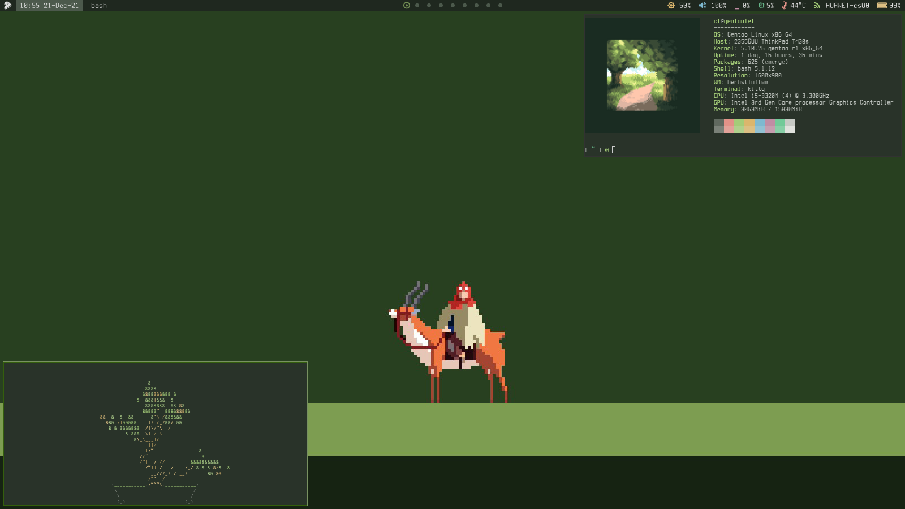

# My dotfiles repository.

## Details:
+ **OS**: [Gentoo](https://www.gentoo.org/)

+ **WM**: [herbstluftwm](https://herbstluftwm.org/)

+ **Terminal**: [kitty](https://sw.kovidgoyal.net/kitty/)

+ **Prompt**: [starship](https://starship.rs/)

+ **Bar**: [polybar](https://polybar.github.io/)

+ **Wallpaper**: [princess mononoke](https://get.wallhere.com/photo/pixel-art-text-logo-green-Princess-Mononoke-Studio-Ghibli-brand-Ashitaka-screenshot-computer-wallpaper-font-180233.png)

+ **Others**: [cbonsai](https://gitlab.com/jallbrit/cbonsai), [neofetch](https://github.com/dylanaraps/neofetch)
